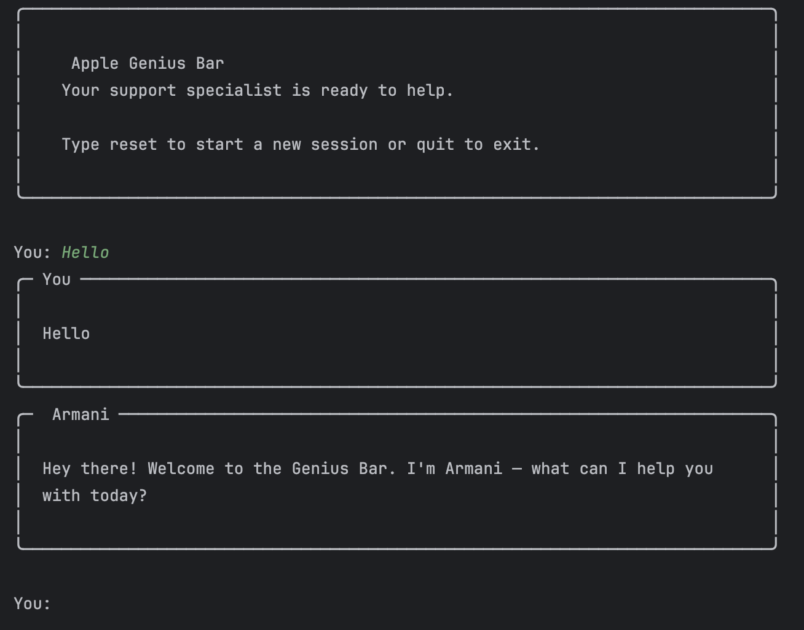

# 🍎 Genius Bar Chatbot

A CLI-based Apple Genius Bar support chatbot powered by Claude AI. 
Ask Juno anything about your Apple devices and get warm, knowledgeable support 
right from your terminal.

## Demo


## Features
- Conversational memory — Juno remembers context within a session
- Graceful scope handling — stays focused on Apple products and services
- Clean terminal UI powered by `rich`
- Easy session reset without restarting

## Setup

### 1. Clone the repo
git clone https://github.com/yourusername/genius-bar-bot.git
cd genius-bar-bot

### 2. Create a virtual environment
python -m venv venv
source venv/bin/activate        # Mac/Linux
venv\Scripts\activate           # Windows

### 3. Install dependencies
pip install -r requirements.txt

### 4. Add your API key
Create a .env file in the root directory:
ANTHROPIC_API_KEY=your-key-here

### 5. Run the chatbot
python cli.py

## Commands
| Command | Action                  |
|---------|-------------------------|
| reset   | Start a new session     |
| quit    | Exit the chatbot        |

## Project Structure
genius-bar-bot/
├── bot/
│   ├── __init__.py
│   ├── agent.py        
│   └── prompts.py      
├── cli.py              
├── .env                
├── .gitignore
├── requirements.txt
└── README.md

## Built With
- [Anthropic Claude API](https://www.anthropic.com)
- [Rich](https://github.com/Textualize/rich)
- [python-dotenv](https://github.com/theskumar/python-dotenv)
```

---

A couple of notes:

**`assets/demo.png`** — the README references a screenshot that doesn't exist yet. Once you have the bot running, take a screenshot of the CLI and drop it in an `assets/` folder. It makes a huge difference on GitHub.

**`__init__.py`** — we haven't created this yet. It's an empty file that tells Python the `bot/` folder is a package, which is what makes `from bot.agent import GeniusAgent` work in `cli.py`. You just create it empty.

---

Here's your complete file checklist before running:
```
✅ bot/__init__.py      (empty file)
✅ bot/prompts.py
✅ bot/agent.py
✅ cli.py
✅ .env                 (with your API key)
✅ .gitignore
✅ requirements.txt
✅ README.md
```

Once those are all in place, run:
```
pip install -r requirements.txt
python cli.py